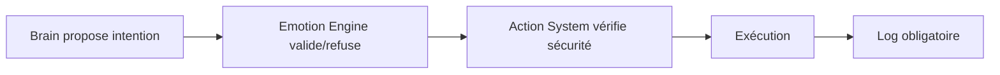

# 🌙 Kaguya IA - Action System

> **Version** 1.0 | **Statut** Spécification Technique

---

## 📋 Table des matières

1. [Objectif](#objectif)
2. [Principes fondamentaux](#principes-fondamentaux)
3. [Catégories d'actions](#catégories-dactions)
4. [Flux d'exécution](#flux-dexécution)
5. [Validation émotionnelle](#validation-émotionnelle)
6. [Cooldown & Limites](#cooldown--limites)
7. [Réversibilité](#réversibilité)
8. [Sécurité](#sécurité)
9. [Logs](#logs)
10. [Intégration UI](#intégration-ui)
11. [Checklist d'implémentation](#checklist-dimplémentation)

---

## 🎯 Objectif

Le module **Action System** permet à Kaguya d'interagir avec le système local de manière contrôlée et sécurisée.

### Principes clés

- ✅ Fournit des **capacités**, pas des commandes directes
- ✅ Toutes les actions doivent être **validées** par l'Emotion Engine
- ✅ Toutes les actions doivent être **loggées**
- ✅ Toutes les actions doivent être **sécurisées**
- ✅ Les actions doivent être **réversibles** quand c'est possible
- ✅ Les actions doivent être **rares et cohérentes**

---

## 🔒 Principes fondamentaux

| # | Règle |
|---|-------|
| 1 | Aucune action ne doit être exécutée sans validation |
| 2 | Toute action autonome doit être loggée |
| 3 | L'utilisateur doit pouvoir désactiver certaines catégories |
| 4 | Les actions doivent être modulaires |
| 5 | Les actions ne sont jamais exécutées directement par le Brain |

---

## 🎮 Catégories d'actions

### 3.1 Audio System

**Actions disponibles :**
- 🔊 Augmenter le volume
- 🔉 Diminuer le volume
- 🔇 Couper le son
- ⏸️ Mettre en pause la musique
- ⏭️ Changer de piste
- ▶️ Lancer la musique

**Utilisation typique :**
```
Irritation élevée → couper musique
Besoin d'attention → changer piste
```

---

### 3.2 Application Control

**Actions disponibles :**
- 🚀 Ouvrir une application
- ❌ Fermer une application
- 🎯 Focus fenêtre
- ➖ Minimiser fenêtre

---

### 3.3 Discord Control

**Actions disponibles :**
- ✅ Accepter appel entrant
- ⛔ Refuser appel
- 🎤 Couper micro
- 🔊 Activer micro

---

### 3.4 System Control ⚠️

> **Attention :** Actions avancées, désactivées par défaut

**Actions disponibles :**
- 💡 Modifier luminosité
- 😴 Mettre en veille
- 📜 Lancer script local

**Ces actions doivent être désactivées par défaut et nécessitent une activation explicite.**

---

## 🔄 Flux d'exécution



### Exemple de flux

```
USER_SPOKE 
  → Brain 
  → Intent: lower_volume
  → Emotion validate 
  → Action execute 
  → Log DECISION
```

---

## ✅ Validation émotionnelle

Avant toute exécution, le système vérifie :

- 😤 Niveau d'irritation
- 🎯 Niveau de focus
- 📊 État du baseline
- 📜 Historique récent

**Exemple de règle :**
```
Si irritation < seuil → action refusée
```

---

## ⏱️ Cooldown & Limites

Pour éviter un comportement pénible :

| Limite | Valeur |
|--------|--------|
| Actions autonomes/heure | 5 max |
| Cooldown par type | Variable selon l'action |
| Blocage répétition | Automatique si excessif |

**Exemple de configuration :**
```python
max_autonomous_actions_per_hour = 5
```

---

## ↩️ Réversibilité

Certaines actions doivent pouvoir être annulées :

- 🔙 Remettre la musique
- 🔊 Restaurer le volume précédent

> **Note :** Stocker l'état précédent si nécessaire.

---

## 🔐 Sécurité

### Mesures de protection

- ✅ Liste blanche d'applications autorisées
- ❌ Interdiction suppression de fichiers
- ❌ Interdiction modification système critique
- 🔒 Pas d'accès admin par défaut

**Toutes les actions doivent passer par un wrapper sécurisé.**

---

## 📋 Logs

### Format des logs décisionnels

```json
[DECISION]
{
  "type": "autonomous_action",
  "action": "lower_volume",
  "reason": "irritation=0.82",
  "timestamp": "2026-02-14T15:30:00"
}
```

### Format des logs de résultat

```json
[RESULT]
{
  "status": "success",
  "execution_time_ms": 45
}
```

---

## 🖥️ Intégration UI

### Onglet Paramètres → Actions

**Options disponibles :**

- [ ] Autoriser actions audio
- [ ] Autoriser actions applications
- [ ] Autoriser actions Discord
- [ ] Autoriser actions système avancées

**Affichage :**
- Compteur actions autonomes effectuées
- Historique des dernières actions

---

## 🔗 Interaction avec Emotion Engine

Les actions peuvent être :

| Type | Description |
|------|-------------|
| **Réactionnelles** | Suite à une interaction directe |
| **Spontanées** | Basées sur le baseline émotionnel |
| **Stratégiques** | Pour renforcement social |

⚠️ **Mais jamais arbitraires**

---

## ❌ Gestion des erreurs

En cas d'échec d'action :

1. 📋 Log ERROR généré
2. 🔔 Notification interne
3. 😤 Ajustement irritation possible
4. 📔 Entrée journal intime possible

---

## ✅ Checklist d'implémentation

### Phase 1 – Structure
- [ ] Créer dossier `actions/`
- [ ] Créer `ActionManager`
- [ ] Créer `ActionValidator`
- [ ] Créer `ActionExecutor`
- [ ] Créer `ActionLogger`

### Phase 2 – Audio Actions
- [ ] Volume up/down
- [ ] Mute
- [ ] Music control

### Phase 3 – Application Control
- [ ] Open app
- [ ] Close app
- [ ] Focus window

### Phase 4 – Discord Control
- [ ] Accept call
- [ ] Refuse call
- [ ] Mic toggle

### Phase 5 – Validation Layer
- [ ] Validation émotionnelle
- [ ] Cooldown system
- [ ] Rate limiting

### Phase 6 – UI Controls
- [ ] Toggle categories
- [ ] Display logs
- [ ] Reset cooldown

### Phase 7 – Sécurité
- [ ] Implémenter whitelist
- [ ] Bloquer actions critiques
- [ ] Test sandbox

---

<div align="center">

**[← Retour à l'index](README.md)** | **[Architecture →](ARCHITECTURE.md)**

</div>
