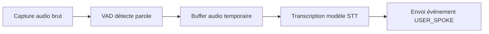
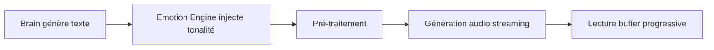

# 🌙 Kaguya IA - Audio Pipeline

> **Version** 1.0 | **Statut** Spécification Technique

---

## 📋 Table des matières

1. [Objectif](#objectif)
2. [Architecture audio](#architecture-audio)
3. [STT (Speech-To-Text)](#stt-speech-to-text)
4. [TTS (Text-To-Speech)](#tts-text-to-speech)
5. [Multithreading audio](#multithreading-audio)
6. [Device Manager](#device-manager)
7. [Gestion de l'interruption](#gestion-de-linterruption)
8. [Modes performance](#modes-performance)
9. [Checklist d'implémentation](#checklist-dimplémentation)

---

## 🎯 Objectif

Le module **Audio Pipeline** gère l'ensemble de la chaîne audio de Kaguya :

### Fonctionnalités principales

- 🎤 **Écoute continue** (STT)
- 🔊 **Synthèse vocale** (TTS)
- 📦 **Gestion des buffers** audio
- ⚡ **Optimisation latence**
- 😊 **Intégration émotionnelle** vocale
- 💾 **Optimisation ressources**

### Caractéristiques requises

- ✅ **Stable** - Fonctionnement fiable
- ✅ **Faible latence** - Réactivité optimale
- ✅ **Streaming** - Compatible streaming audio
- ✅ **Interrompable** - Arrêt immédiat possible
- ✅ **Multitâche** - Compatible mode concurrent

---

## 🏗️ Architecture audio

### Structure des dossiers

```
audio/
 ├── stt/                      # Speech-To-Text
 ├── tts/                      # Text-To-Speech
 ├── audio_manager.py          # Gestionnaire principal
 ├── audio_buffer.py           # Gestion des buffers
 ├── vad.py                    # Voice Activity Detection
 ├── device_manager.py         # Gestion périphériques
 └── audio_logger.py           # Journalisation audio
```

---

## 🎤 STT (Speech-To-Text)

### 3.1 Mode écoute continue

**Configuration par défaut :**

- ✅ Micro actif en permanence
- ✅ Détection VAD (Voice Activity Detection)
- ⚙️ Wake word optionnel (paramétrable dans l'UI)

> **Note :** Le wake word n'est **pas** obligatoire par défaut.

---

### 3.2 Pipeline STT



**Étapes détaillées :**

1. 📥 Capture audio brut depuis le micro
2. 👂 VAD détecte l'activité vocale
3. 📦 Stockage dans buffer temporaire
4. 🤖 Transcription via modèle STT
5. 📤 Envoi de l'événement `USER_SPOKE`

---

### 3.3 Contraintes techniques

| Contrainte | Objectif |
|------------|----------|
| **Latence** | < 500 ms idéalement |
| **Threading** | Ne pas bloquer le thread principal |
| **Robustesse** | Gérer coupures micro |
| **Flexibilité** | Gérer changement périphérique à chaud |

---

### 3.4 Optimisation

**Stratégies d'optimisation :**

- 🎮 Mode low precision STT si gaming actif
- ⏸️ Pause automatique si CPU saturé
- ⚙️ Paramètre qualité STT configurable dans UI

---

## 🔊 TTS (Text-To-Speech)

### 4.1 Objectif

Produire une voix :
- 🎭 **Naturelle** - Sons fluides et humains
- 😊 **Émotionnelle** - Reflet de l'état interne
- 💫 **Fluide** - Sans coupures artificielles

**Ce qu'il ne faut PAS :**
- ❌ Phrases mécaniques type "Je réfléchis..."
- ❌ Répétitions robotiques
- ❌ Annonces explicites de calcul

---

### 4.2 Pipeline TTS



**Détails du processus :**

1. 🧠 Brain génère le texte de réponse
2. 😊 Emotion Engine injecte la tonalité émotionnelle
3. 🔧 Pré-traitement (broderie naturelle si latence)
4. 🎵 Génération audio en streaming
5. ▶️ Lecture progressive des chunks audio

---

### 4.3 Streaming vocal

**Règle obligatoire :** Streaming activé

- ✅ Ne **jamais** attendre la génération complète
- ✅ Lire les chunks audio dès disponibilité
- ✅ Réduire le time-to-first-sound

---

### 4.4 Gestion de la latence

**Stratégie en cas de latence détectée :**

```python
if latency_detected:
    # Insertion de micro-phrases naturelles
    - "Hmm..."
    - Soupir léger
    - Courte pause naturelle
    # Puis reprise fluide
```

**Ce qu'il ne faut JAMAIS faire :**
❌ Annoncer explicitement "je cherche"

---

### 4.5 Intégration émotionnelle

**L'Emotion Engine fournit :**

| Paramètre | Description |
|-----------|-------------|
| **Ton** | Ton recommandé (joyeux, irrité, neutre...) |
| **Intensité** | Force de l'émotion (0.0-1.0) |
| **Rythme** | Vitesse de parole conseillée |
| **Chaleur** | Niveau de chaleur vocale |

**Paramètres TTS ajustables :**

```python
{
    "speed": float,        # Vitesse de parole
    "pitch": float,        # Hauteur tonale
    "emotion_strength": float  # Intensité émotionnelle
}
```

---

## 🧵 Multithreading audio

### Threads recommandés

```
Thread 1 : Capture micro       (STT input)
Thread 2 : STT processing      (Transcription)
Thread 3 : TTS generation      (Synthèse)
Thread 4 : Audio playback      (Lecture)
Thread 5 : Logging             (Journalisation)
```

**Règle importante :** Aucun blocage du Brain principal.

---

## 🎛️ Device Manager

### Fonctionnalités

Le Device Manager doit gérer :

- 🎤 **Sélection micro** - Choix du périphérique d'entrée
- 🔊 **Sélection sortie** - Choix du périphérique de sortie
- 🔄 **Hot-swap** - Changement périphérique à chaud
- ❌ **Gestion erreurs** - Récupération erreurs driver

**L'UI doit permettre une sélection explicite des périphériques.**

---

## ⏸️ Gestion de l'interruption

### Comportement en cas d'interruption

**Si l'utilisateur parle pendant le TTS :**

1. ⏹️ Stop playback **immédiatement**
2. 👂 Priorité à l'écoute
3. 📋 Log de l'interruption

**Événement déclenché :**
```
Event: USER_INTERRUPTION
```

---

## ⚡ Modes performance

### Mode Standard

```yaml
STT: Haute qualité
TTS: Émotionnel complet
Streaming: Actif
Study: Activé
```

---

### Mode Gaming 🎮

```yaml
STT: Optimisé (low precision)
TTS: Léger
Streaming: Actif
Study: Suspendu
Priority: FPS
```

---

### Mode Économie 🔋

```yaml
STT: Fréquence réduite
TTS: Sans broderie
Streaming: Basique
Study: Suspendu
```

---

## 📋 Logging audio

### Logs obligatoires

#### Input Audio
```json
[AUDIO_INPUT]
{
  "duration": 1.5,
  "vad_trigger": true
}
```

#### STT Result
```json
[STT_RESULT]
{
  "text": "Bonjour Kaguya",
  "confidence": 0.95,
  "latency_ms": 320
}
```

#### TTS Start
```json
[TTS_START]
{
  "emotion_state": "neutral",
  "mode": "streaming"
}
```

#### TTS Stream Chunk
```json
[TTS_STREAM_CHUNK]
{
  "chunk_time_ms": 45
}
```

#### TTS End
```json
[TTS_END]
{
  "total_duration_ms": 2150
}
```

#### Interruption
```json
[INTERRUPTION]
{
  "reason": "user_speaking",
  "tts_progress": 0.65
}
```

---

## 🔒 Sécurité

### Mesures de protection

- ⚙️ **Micro désactivable** via UI
- 👁️ **Indicateur visuel** micro actif
- 🚫 **Aucun enregistrement** persistant sans consentement
- 🧹 **Nettoyage buffer** mémoire automatique

---

## 🔄 Modèles interchangeables

### Configuration UI

L'UI doit permettre :

- 🎤 **Sélection modèle STT**
- 🔊 **Sélection modèle TTS**
- ⚙️ **Sélection quantisation**
- 🧪 **Test instantané** des modèles

### Support prévu

- ✅ GPT-SoVITS
- ✅ XTTS
- ✅ Autres modèles compatibles

---

## 🔗 Intégration avec Emotion Engine

**Le module audio ne décide rien.**

### Il reçoit :

- 🎨 Style recommandé
- 💪 Intensité émotionnelle
- ⚡ Niveau d'énergie

### Il exécute uniquement.

---

## ✅ Checklist d'implémentation

### Phase 1 – Structure
- [ ] Créer dossier `audio/`
- [ ] Créer `AudioManager`
- [ ] Créer `DeviceManager`
- [ ] Créer `AudioLogger`

### Phase 2 – STT
- [ ] Capture micro continue
- [ ] Implémenter VAD
- [ ] Intégrer modèle STT
- [ ] Événement `USER_SPOKE`

### Phase 3 – TTS
- [ ] Intégrer modèle TTS
- [ ] Streaming audio
- [ ] Intégrer paramètres émotion

### Phase 4 – Interruption
- [ ] Stop TTS si parole détectée
- [ ] Log interruption

### Phase 5 – Performance
- [ ] Mode gaming
- [ ] Mode économie
- [ ] Benchmark latence

### Phase 6 – UI
- [ ] Sélection périphériques
- [ ] Toggle wake word
- [ ] Toggle écoute continue
- [ ] Test STT
- [ ] Test TTS

---

<div align="center">

**[← Retour à l'index](README.md)** | **[Memory System →](MEMORY_SYSTEM.md)**

</div>
